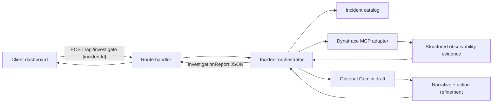

# PulsePilot Architecture

## 1. System Topology

PulsePilot is a single Next.js application with three cooperating layers:

1. `app/` route handlers expose the backend contract for incident listing and investigation.
2. `lib/` contains the agent orchestration logic, scoring heuristics, optional Gemini drafting, and the Dynatrace MCP adapter.
3. `components/` renders the command-center UI and orchestrates user interaction on the client.

The runtime can operate in two modes:

- `mock` mode, which uses deterministic catalog data and heuristic incident analysis.
- `mcp` mode, which attempts to connect to the Dynatrace MCP server and enrich the report with live observability context.

## 2. Data Flow



### API Surface

- `GET /api/incidents`
  - Returns the incident catalog for the dashboard.
- `POST /api/investigate`
  - Body: `{ "incidentId": string }`
  - Returns a full `InvestigationReport`.

## 3. File Tree Specification

```text
dynatrace-pulsepilot/
├── .env.example
├── .eslintrc.json
├── .gitignore
├── eslint.config.mjs
├── LICENSE
├── README.md
├── DEMO_RUNBOOK.md
├── SUBMISSION.md
├── SUBMISSION_CHECKLIST.md
├── PITCH.md
├── app/
│   ├── api/
│   │   ├── incidents/
│   │   │   └── route.ts
│   │   └── investigate/
│   │       └── route.ts
│   ├── apple-icon.png
│   ├── icon.svg
│   ├── icon.png
│   ├── globals.css
│   ├── layout.tsx
│   └── page.tsx
├── components/
│   ├── analysis-panel.tsx
│   ├── dashboard.tsx
│   └── incident-list.tsx
├── docs/
│   ├── architecture.md
│   ├── competitive-inversions.md
│   └── progress-manifest.md
├── lib/
│   ├── agent.ts
│   ├── dynatrace.ts
│   ├── gemini.ts
│   ├── incidents.ts
│   ├── scoring.ts
│   ├── types.ts
│   └── utils.ts
├── public/
│   └── pulsepilot-logo.png
├── next-env.d.ts
├── next.config.ts
├── package-lock.json
├── package.json
├── tsconfig.json
└── vercel.json
```

## 4. State Management & Security

- The client holds only UI state: selected incident, loading status, and the latest report.
- The server owns the incident report generation path. Sensitive integration logic never runs in the browser.
- `zod` validates every API payload before it reaches the agent.
- The Dynatrace MCP connection is opt-in through environment variables and fails closed to deterministic fallback mode.
- Gemini drafting is optional and isolated behind a server-side API key; the browser never sees the key.
- The remediation plan is intentionally gated. Suggested actions are classified as safe or approval-required, which prevents the app from implying unauthorized automatic changes.
- The app never stores credentials in local storage or embeds them in client bundles.

## 5. Competitive Inversions

See [`competitive-inversions.md`](./competitive-inversions.md) for the prior-art analysis and the ways PulsePilot improves on existing open-source incident-response and observability tooling.
